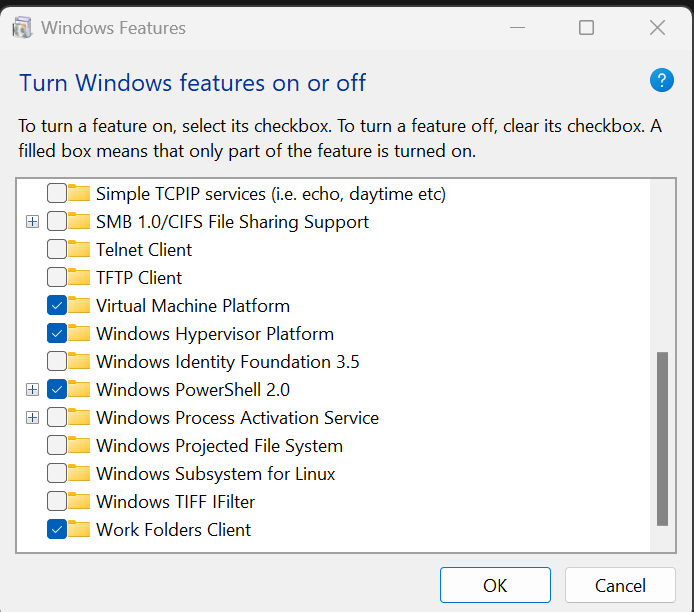

---  
sidebar_position: 1  
sidebar_label: Setup WSL
id: setup-wsl
title: Setup Windows Subsytem for Linux
date: 2`02`4-10-07 11:12:48
author: Rob Reeve
description: Setup Windows Subsytem for Linux
tags: 
  - WIP
  - MachineSetup
  - WSL
  - Windows
---  

<!-- SPDX-License-Identifier: CC-BY-SA-4.0 -->

WSL is Windows Subsystem for Linux. There are some great improvements from WSL2, and WSL2 is now publically available (including GUI based OSes).

I used [this tutorial](https://pureinfotech.com/install-wsl-windows-11/) to create these instructions, but it also shows how to uninstall WSL and Ubuntu.

## Make Sure Windows is up to date

If you haven’t done the windows update yet, head to Windows Update and install all available. Once you have completed the updates - and checked that there are no further updates, you can continue. (Windows Updates may require a restart before showing the next available download)

## Enable the Virtual Machine Platform

Click on Start and Search for `Turn Windows Features on or off` and click the top result to open the page.

Check the Virtual Machine Platform option.



Click the OK button.

Click the Restart button. This will restart your computer

After completing the steps above, you can download the WSL app from the Microsoft Store.

## Install Windows Subsystem for Linux

1. Open Windows Powershell and Run as Administrator
2. run wsl install ```wsl -- install```
3. restart your computer
4. This will launch Ubuntu after restarting

Once you complete the steps, WSL will install on Windows 11, including the support for Linux GUI apps.

## Setup Ubuntu

If Ubuntu does not install by default, select and install Ubuntu from the Windows Store [here](https://apps.microsoft.com/store/detail/ubuntu/9PDXGNCFSCZV?hl=en-us&gl=us). If things go wrong, you can do a manual install of Ubuntu (as this can be more stable)  

Once you have installed Ubuntu, you will be asked to create a user and set a secure password - this is different to the windows user - and will be used when you log in to your local ubuntu

```bash
Installing, this may take a few minutes...
Please create a default UNIX user account. The username does not need to match your Windows username.
For more information visit: https://aka.ms/wslusers
Enter new UNIX username: <My_User>
New password:
Retype new password:
passwd: password updated successfully
Installation successful!
To run a command as administrator (user "root"), use "sudo <command>".
See "man sudo_root" for details.

Welcome to Ubuntu 22.04.3 LTS (GNU/Linux 5.15.153.1-microsoft-standard-WSL2 x86_64)

 * Documentation:  https://help.ubuntu.com
 * Management:     https://landscape.canonical.com
 * Support:        https://ubuntu.com/advantage

This message is shown once a day. To disable it please create the
/home/<My_User>/.hushlogin file.
<MyUser>@<MyComputer>:~$

```

## Check the current WSL version

You should now type the following in an administrator PowerShell:

```Powershell
WSL -l -v
```

You should get an output similar to this:

```Powershell
  NAME      STATE           VERSION
* Ubuntu    Stopped         2
```

Note: if you pre-installed Ubuntu, it might say `VERSION 1` - which means you will need to upgrade it.
Note: if you have an open Ubuntu session, STATE will be `Running`

### Forcing Ubuntu to stop

You can kill any open Ubuntu sessions, by running the following command:

```Powershell
wsl -t Ubuntu
```

## Backup your Ubuntu if already installed and not up to date

Before running the update of your version, it is recommneded that you do a backup. This command will back up to the location of your command prompt

```Powershell
wsl.exe --export Ubuntu ubuntu-backup.tar.gz
```

## Updated to WSL2

```Powershell
wsl --set-version Ubuntu 2
```

## Upgrade Ubuntu

```bash
sudo apt update && sudo apt upgrade
```
