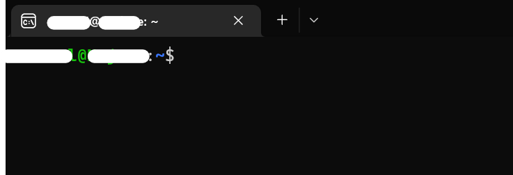
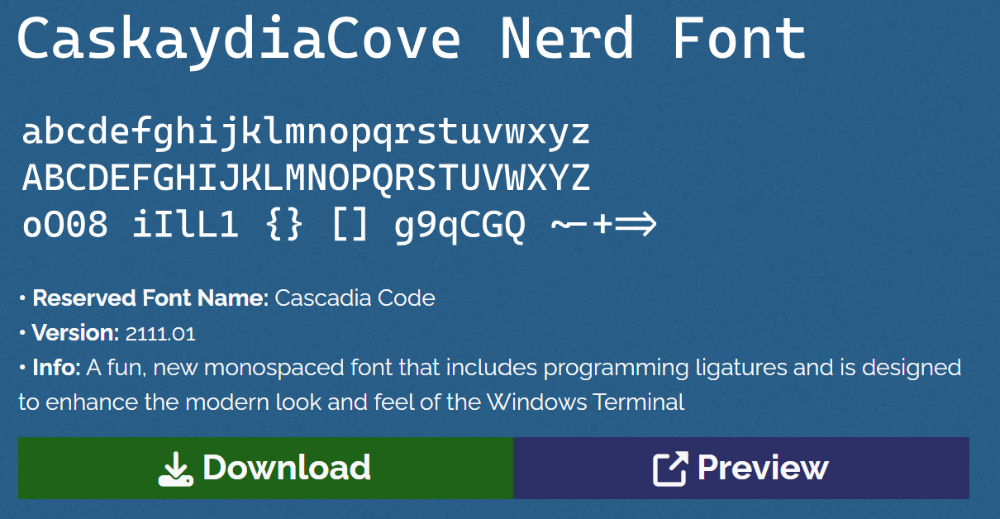
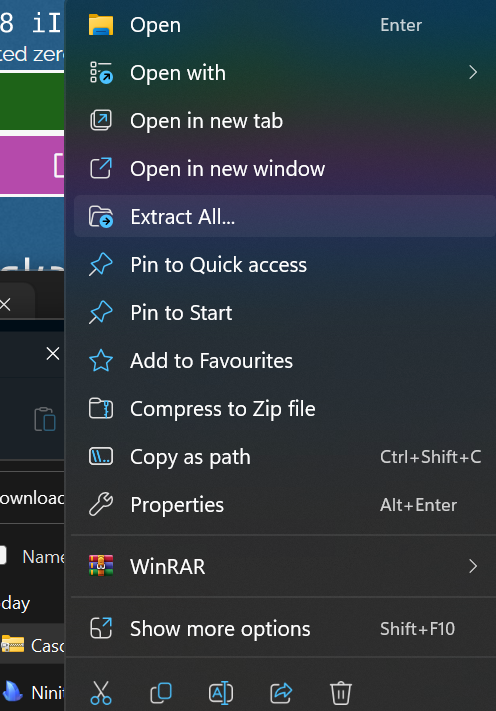
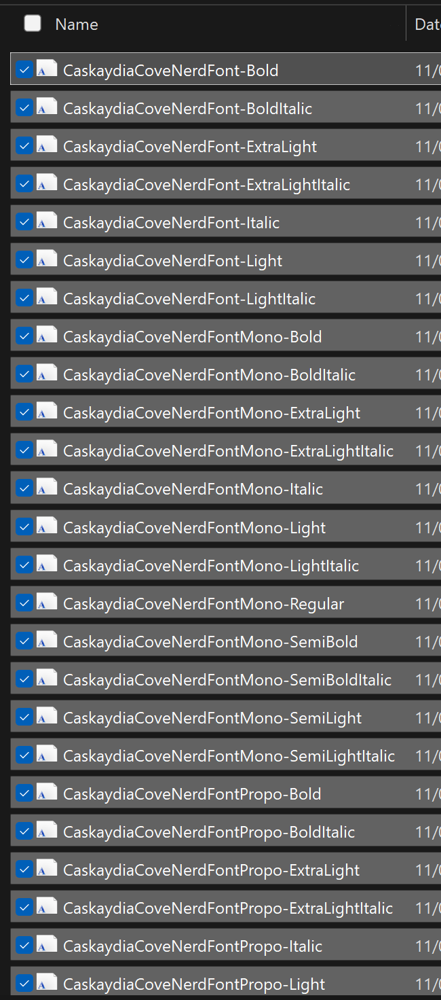
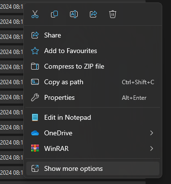
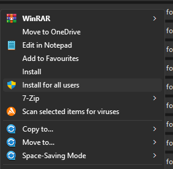
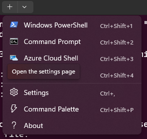
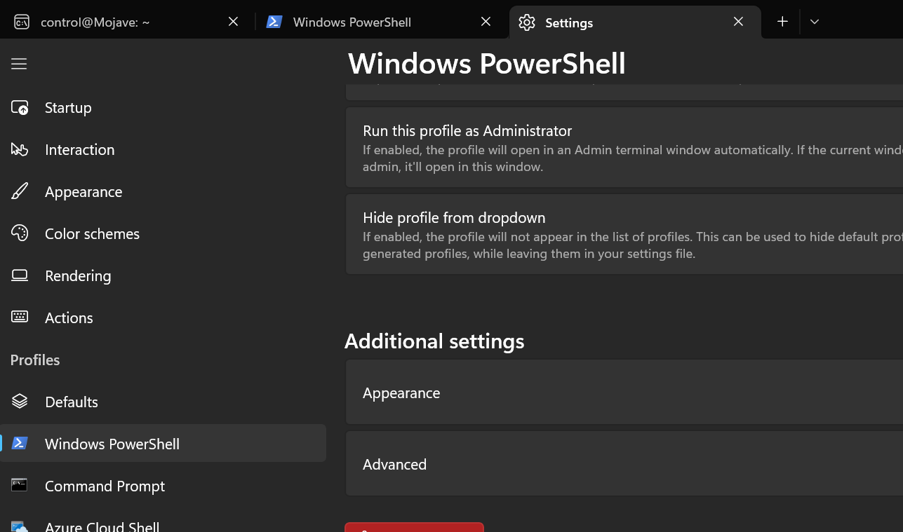
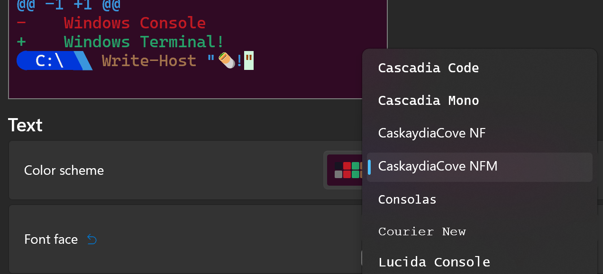

---  
sidebar_position: 1  
sidebar_label: Oh-My-Posh
id: oh-my-posh
title: Setup Oh My Posh WSL
date: 2024-07-10 10:29:47
author: Rob Reeve
description: Setup Oh My Posh - WSL
tags: 
  - WIP
  - OhMyPosh
  - Windows
  - MachineSetup
---  

<!-- SPDX-License-Identifier: CC-BY-SA-4.0 -->

## Pre requisites

- [x] Install Windows Terminal from the Microsoft Store
- [x] Install Ubuntu 22.04 or newer from the Microsoft Store

Initial Instructions were taken from [here](https://learn.microsoft.com/en-us/windows/terminal/tutorials/custom-prompt-setup) and tweaked a little

This tutorial provides some resources and direction to help you customize your command prompt for PowerShell (if you have the right permissions) or Windows Subsystem for Linux (WSL) using Oh My Posh. Oh My Posh provides theme capabilities for a fully customized command prompt experience providing Git status color-coding and prompts.

## Install the WSL

You should have followed the instructions from [Windows_11_wsl2.md](01_windows_11_wsl2.md)

Launch an Ubuntu session in Windows Terminal, and you might see something like below:



## Install a Nerd Font

Customized command prompts often use glyphs (a graphic symbol) in order to style the prompt. If your font does not include the appropriate glyphs, you may see several Unicode replacement characters '▯' throughout your prompt. In order to see all of the glyphs in your terminal, we recommend installing a [Nerd Font](https://www.nerdfonts.com/font-downloads).

If you'd like a font that looks like Cascadia Code, the Caskaydia Cove Nerd Font was built from the Cascadia Code repository by a community member.

### Install for all users

After downloading, you will need to unzip and install the font on your system. ([How to add a new font to Windows](https://support.microsoft.com/en-us/office/add-a-font-b7c5f17c-4426-4b53-967f-455339c564c1)).

1. Download the file  

  

2. Extract the file  

  

3. Go into the folder  
4. Select the fonts  

  

5. Right Mouse click over them and choose show more options  

  

6. install for all users  

  

You might need to restart for the fonts to be detected.

### Configure Terminal

To set a Nerd Font for use with Oh My Posh and Terminal Icons, open the Windows Terminal settings UI by selecting Settings (Ctrl+,) from your Windows Terminal dropdown menu. Select the profile where you wish to apply the font, PowerShell for example, and then the Appearance tab. In the Font face drop-down menu, select CaskaydiaCove Nerd Font or whichever Nerd font you would like to use with your customized prompt.

1. Select the drop down arrow at the top of Terminal, and choose settings  



2. Select the appropriate Profile (i.e. PowerShell or Ubuntu) and select Appearance  



3. Under Font Face, you can select the desired font  



:::note

If you want to use a terminal font that does not support glyph icons, such as Cascadia Code PL, you may consider using an Oh My Posh theme that contains the minimal function, indicating that additional icons aren't required.

:::

## Customize your WSL prompt with Oh My Posh

Oh My Posh now allows you to customize WSL prompts, as well as a PowerShell prompt using built-in themes.

### Install Oh My Posh for WSL

We are now going to jump to the [Ubuntu settings](../ubuntu/01_server_setup/03_oh_my_posh.md)

## Customize your PowerShell prompt with Oh My Posh

Oh My Posh enables you to use a full color set to define and render your terminal prompt, including the ability to use built-in themes or create your own custom theme.

### Install Oh My Posh for PowerShell

To customize your PowerShell prompt, you can install Oh My Posh using [winget](https://learn.microsoft.com/en-us/windows/package-manager/winget). To use the Microsoft Store version of Oh My Posh, which will automatically update when new versions are available, use the command:

```PowerShell
winget install XP8K0HKJFRXGCK
```

This will install:

- oh-my-posh.exe: The Windows executable
- themes: The latest Oh My Posh themes

You will need to agree to the source terms and may run into the instance that more than one package is available. In this case, select package ID that you wish to use and re-enter the command: winget install `<package ID>`.

Enter `oh-my-posh --version` to confirm the version number of your Oh My Posh installation. To ensure you have the latest updates, you can use the following command: `winget upgrade oh-my-posh`.

> Note
> If you want to install the newest version of Oh My Posh in PowerShell, you may want to first remove the OMP module's cached files and uninstall the old module. There are instructions on how to do this in the Oh My Posh docs. If you are more familiar with the Scoop installer or a manual installation method that allows automation, these can also be used for installing on Windows, just follow the instructions in the [Oh My Posh docs](https://ohmyposh.dev/docs/installation/windows).

### Choose and apply a PowerShell prompt theme

You may browse the full list of themes on the [Oh My Posh themes page](https://ohmyposh.dev/docs/themes).

Choose a theme and update your PowerShell profile with this command. (You can replace notepad with the text editor of your choice.)

```PowerShell
notepad $PROFILE
```

Add the following to the end of your PowerShell profile file to set the `paradox` theme. (Replace `paradox` with the theme of your choice.)

> Info
> If there is no profile make sure to create the profile first
>
> ```Powershell
>  New-Item -Path $PROFILE -Type File -Force
> ```

```PowerShell
oh-my-posh init pwsh --config "$env:POSH_THEMES_PATH\paradox.omp.json" | Invoke-Expression
```

Now, each new PowerShell instance will start by importing Oh My Posh and setting your command line theme.

> Note
> This is not your Windows Terminal profile. Your PowerShell profile is a script that runs every time PowerShell starts. [Learn more about PowerShell profiles](https://learn.microsoft.com/en-us/powershell/module/microsoft.powershell.core/about/about_profiles).
> Tip
> Oh My Posh can be configured to restore the current working directory by enabling `osc99` in the General Settings. [See the Oh My Posh docs](https://ohmyposh.dev/docs/configuration/overview#general-settings).

## Use Terminal-Icons to add missing folder or file icons

[Terminal-Icons](https://github.com/devblackops/Terminal-Icons) is a PowerShell module that adds file and folder icons that may be missing when displaying files or folders in Windows Terminal, looking up their appropriate icon based on name or extension. It attempts to use icons for well-known files/folders, but falls back to a generic file or folder icon if one is not found.

To install Terminal-Icons with PowerShell, use the command:

```PowerShell
Install-Module -Name Terminal-Icons -Repository PSGallery
```

For more information, including usage and commands, see the [Terminal-Icons](https://github.com/devblackops/Terminal-Icons) repo on GitHub.
