---  
sidebar_position: 1  
sidebar_label: CLI
id: git-windows-cli
title: Git Windows CLI
date: 2024-09-11 13:13:24
author: Rob Reeve
description: Git CLI for Windows
tags: 
  - WIP
  - Git
  - Windows
  - MachineSetup
---

<!-- GNU GENERAL PUBLIC LICENSE: Copyright © 2024 LexTego--> 

## Setup Git for Windows  

Go to [Git for Windows](https://git-scm.com/download/win) and download the right version for you (in our case 64 bit Git for Windows)

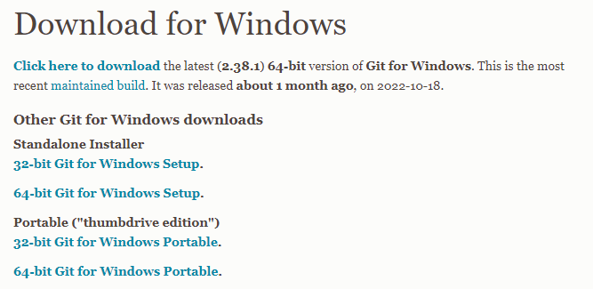

Once downloaded, run the file

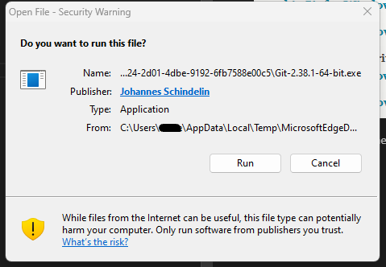

Allow the app to make changes, then choose next,  

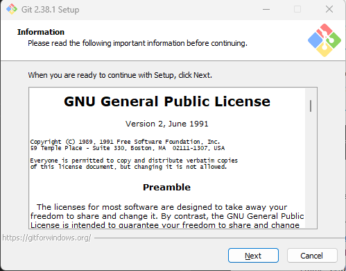

Leave the default location

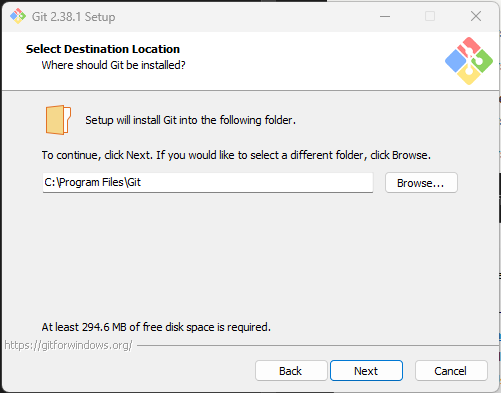

Add the Git Bash option for Terminal, but leave the remainder  

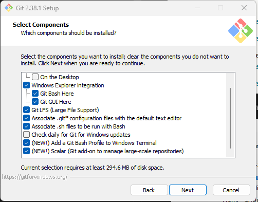  

Leave the default Git settings  

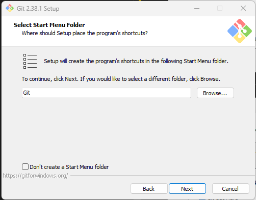  

Change the editor to VS Code

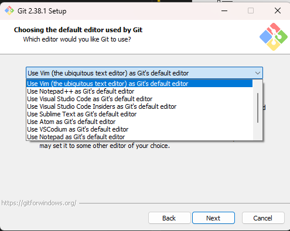  

Change the initial branch to main

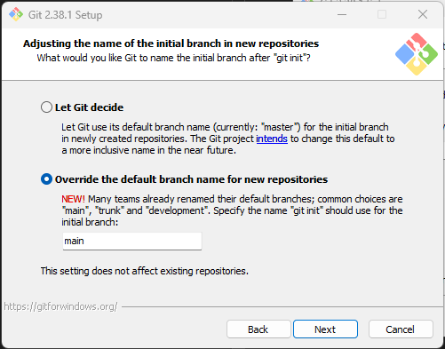  

Allow the path to be updated

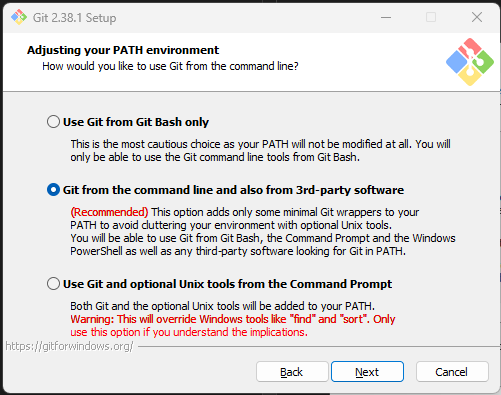  

Use the default OpenSSH  

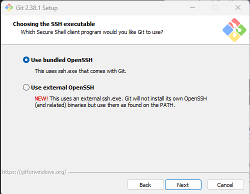  

Use the default OpenSSL  

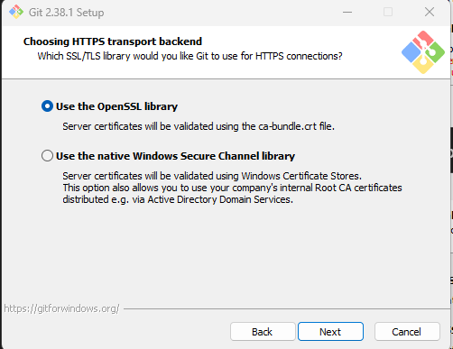  

Use the default Windows line Style  

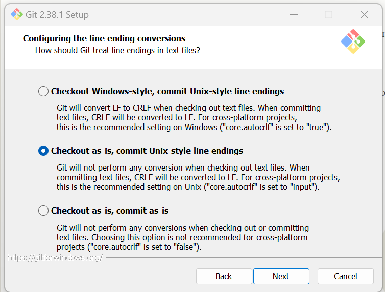  

Use the Windows Terminal  

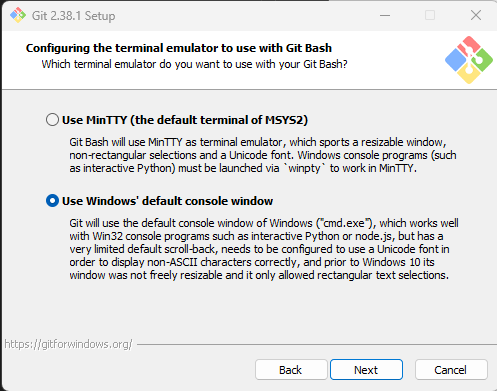  

Use the default "git pull" behaviour  

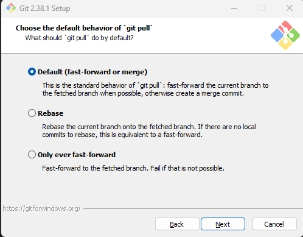  

Use the default "git credential" manager  

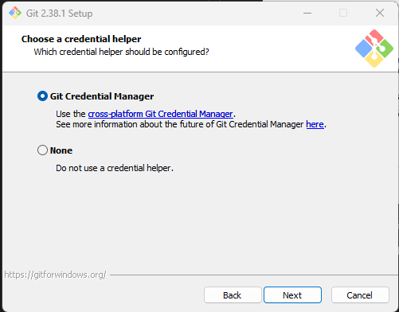  

Use the default "sym link" behaviour  

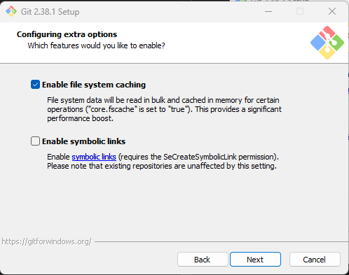  

Skip the remainder and install  

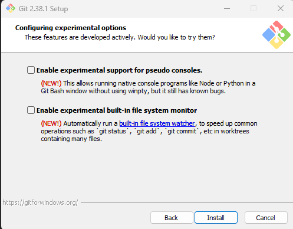  

Once completed - just finish
