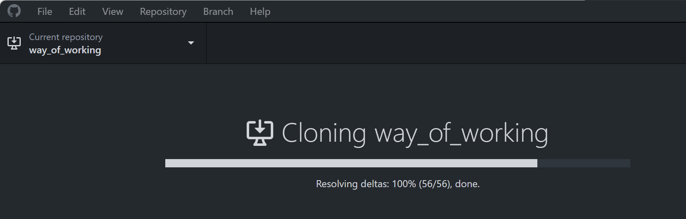

---  
sidebar_position: 1  
sidebar_label: Github Desktop
id: github-desktop
title: Github Desktop
date: 2024-09-11 13:06:47
author: Rob Reeve
description: Github Desktop
tags: 
  - WIP
  - Git
  - Windows
  - MachineSetup
---  

<!-- SPDX-License-Identifier: CC-BY-SA-4.0 -->

We use GitHub Desktop to simplify the GitHub process for those who are learning Git.

## Installation

After dowloading the app, we are asked to Sigh in to GitHub - we use our LexTego GitHub account

Once we authenticate, it will take us back to our desktop with our details filled in

## Copy our existing Repos

Before starting this check out the recommendations in [working with git and folders](working_with_git_and_folders.md)

We select Clone a repository from the internet...

we can choose from our existing repositories from LexTego or your own repos, we can also choose where the files are saved to.

Let's start with the repository containing our way of working - type `wa` in the filter box and choose where you wish to store it

It will now clone the repo to this location

We now have a working repo

## Adding another repo

We can easily add another repo by clicking on the Add option after clicking on the drop down on the current repository

## Work in Branches

07

10

08

09

