---  
sidebar_position: 1  
sidebar_label: GPG4Win
id: gpg4win
title: GPG for Windows
date: 2024-10-23 09:58:18
author: Rob Reeve
description: Installing GPG for Windows
tags: 
  - WIP
  - GIT
---  

<!-- SPDX-License-Identifier: CC-BY-SA-4.0 -->

## Installing

Go to the [GNUPG download section](https://gnupg.org/download/index.html) and scroll down to select the Windows Installer - GPG4Win

- When you have downloaded, open the file, you will be asked if you want to allow this app to make changes to your device - select Yes
- Choose your language

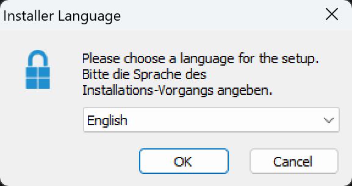

- Accept to continue

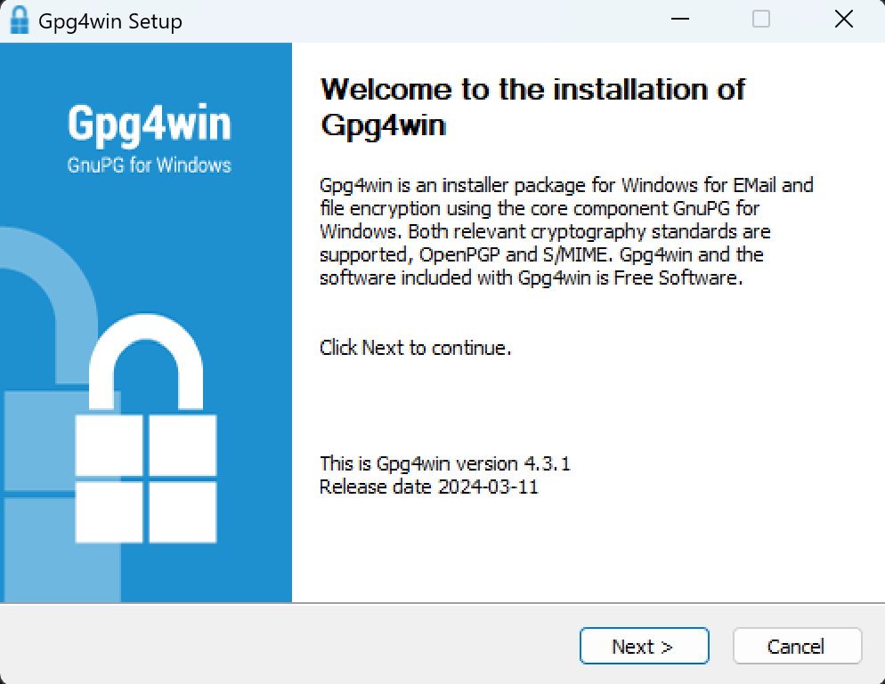

- Choose Components

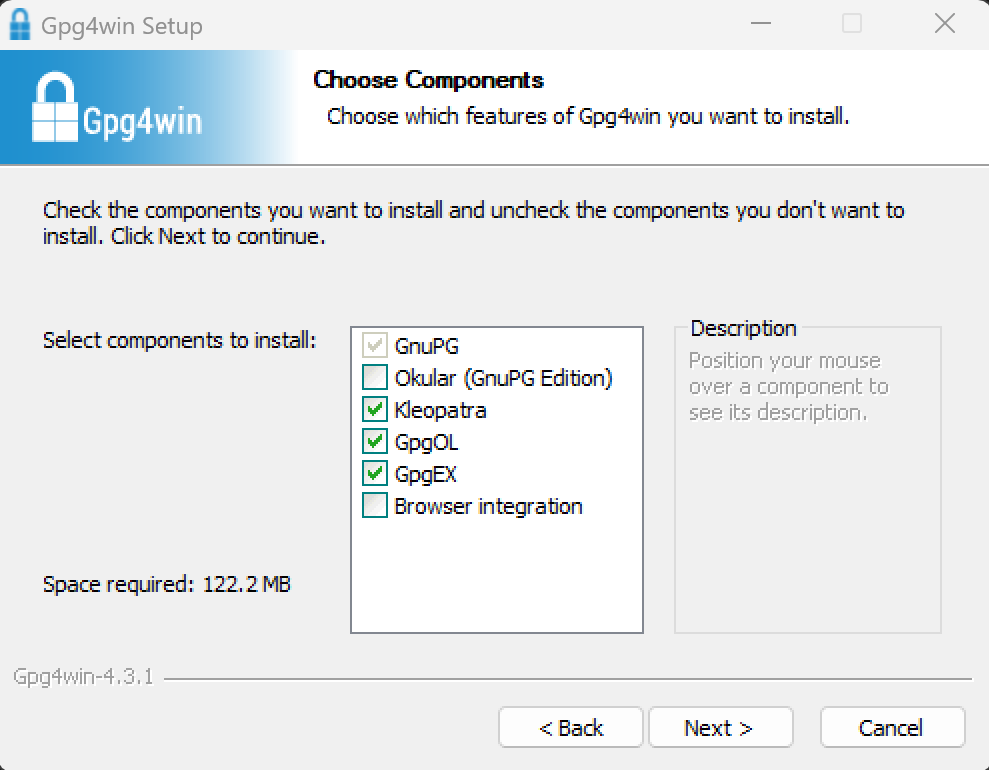

- Choose Location

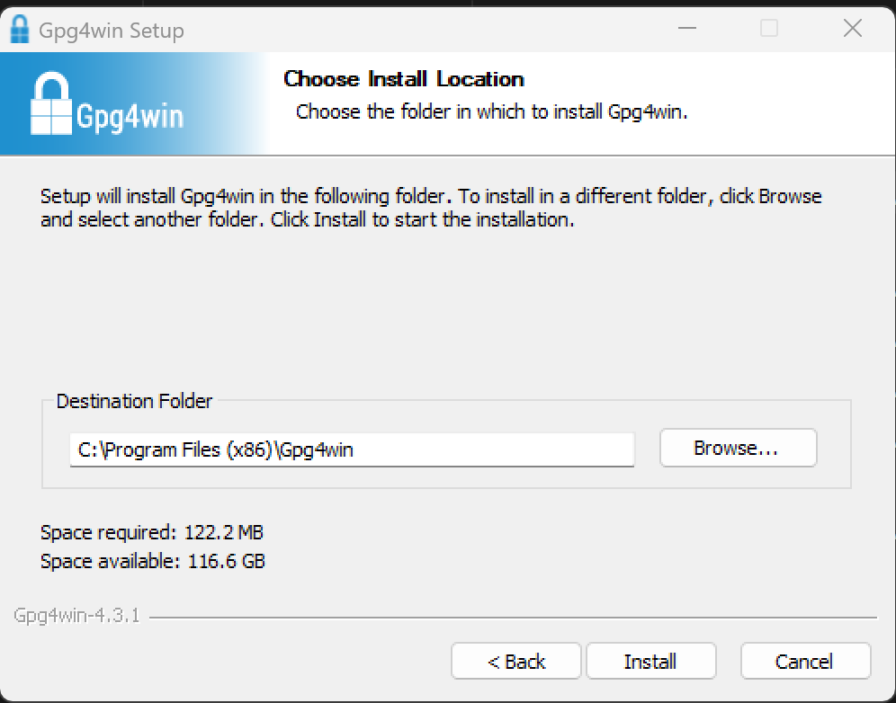

- When complete choose Next

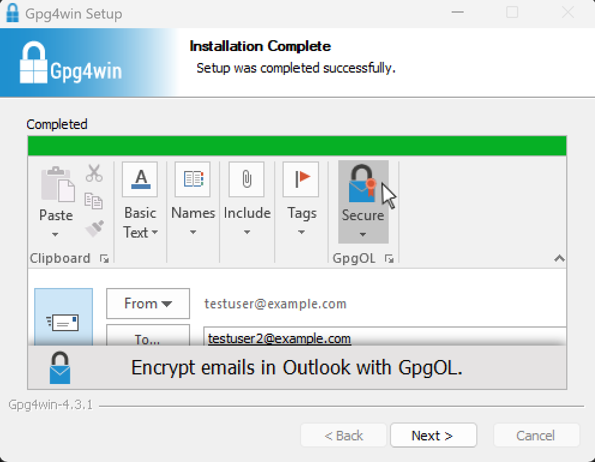

- When completed choose Finish after ensuring we launch Kleopatra

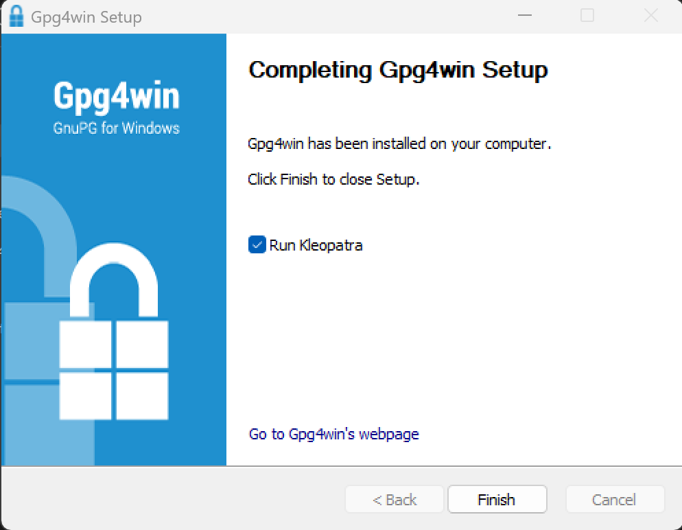

## Creating a Key Pair in Kleopatra

Once you launch Kleopatra, you are able to create a New Key Pair

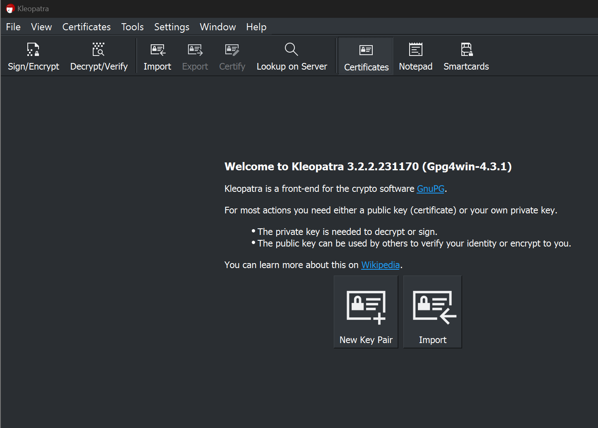

- enter your details, ensuring that we protect with a passphrase (this will be entered every time the certificate is used)

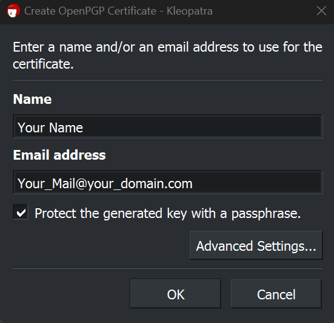

:::warning

If you are using this for GitHub, and you have not shared your email address, then use your no-reply address

GitHub > Settings > (access) Emails
number+account@users.noreply.github.com
:::

- Select Advanced details, and ensure we are creating an ECDSA key, that can be used for signing. Change the expiry date if you wish

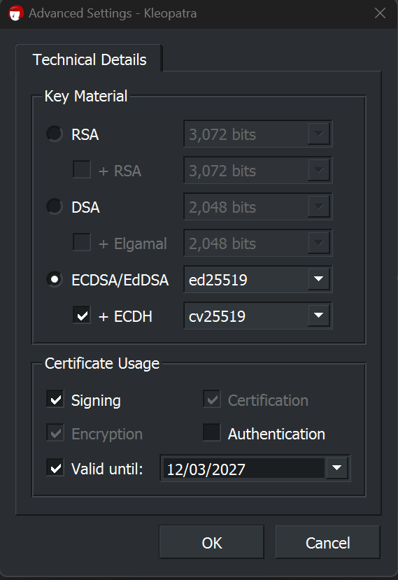

- choose OK to return to basic settings
- choose OK if you are happy to create the certificate.
- you will be asked to enter the passphrase you wish to use

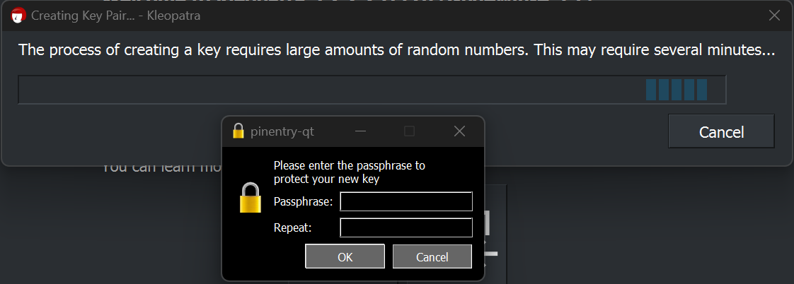

- once completed you will be provided with your certificate's fingerprint 

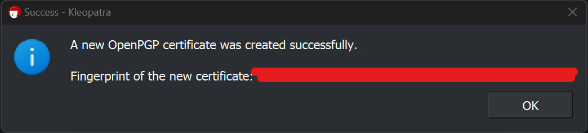

You can repeat the process, and change for RSA if you desire