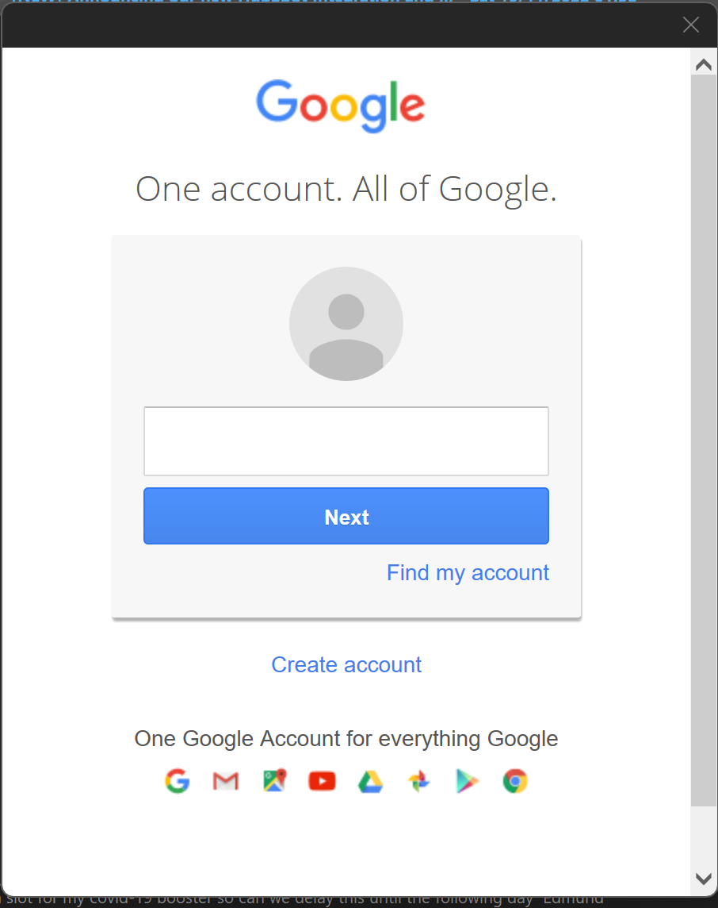

---  
sidebar_position: 1  
sidebar_label: Outlook
id: outlook-setup
title: Setting Up MS Outlook
date: 2024-09-11 16:23:47
author: Rob Reeve
description: Setting up MS Outlook
tags: 
  - WIP
  - Windows
  - MachineSetup
  - Outlook
---  

<!-- SPDX-License-Identifier: CC-BY-SA-4.0 -->

This approach has been tested on a Windows Machine - please feel free to correct for a Mac.

If you needed Office locally, you would have been able to install it locally during your setup process.
You should have installed Outlook from [Office.com](https://www.office.com/) - if not, go there now, and install office first.

## Launch Outlook

When you start office for the first time, you will be asked to accept the licence

You will then be asked to choose an email address - this will be based on the user name used when installing windows, or on your account name. Make sure it is your LexTego email

Once Installed, you can add other emails if desired - please note as a company laptop, you may install other email addresses, but that means contents might be reviewed by other employees.

Once you have added what you need, you can click on Done

## Adding accounts, after connecting

Go to the File Menu

Then Select Add account

Enter the email address in the box

## Google email Accounts

If the account is from Google, enter the email address `<My_Name>@gmail.com`

Enter the Password

If necessary authenticate

Allow access

### Detailed Google Settings

| Item                        | Setting             |
| --------------------------- | ------------------- |
| Your name                   | <My_Name>           |
| Email address               | <My_User>@Gmail.com |
| Account type                | IMAP                |
| Incoming mail server        | imap.Gmail.com      |
| Outgoing mail server (SMTP) | smtp.Gmail.com      |
| User name                   | <My_User>@Gmail.com |
| Password                    | Your Gmail password |

SMTP Setting
| Item | Setting |
| ---------------------------------------------- | ------- |
| Incoming server (IMAP) | 993 |
| Use the following type of encrypted connection | SSL |
| Outgoing server (SMTP) | 465 |
| Use the following type of encrypted connection | SSL |
