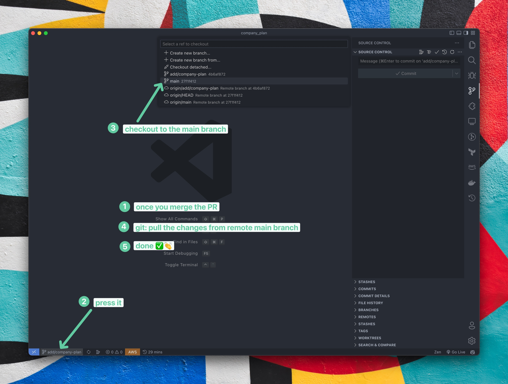

---  
sidebar_position: 1  
sidebar_label: PR Creation
id: prCreation
title: Pull Request Creation
date: 2024-09-03 12:34:44
author: Rob Reeve
description: How to create a Pull Request
tags: 
  - WIP
  - Git
  - PR
  - training
---  

<!-- GNU GENERAL PUBLIC LICENSE: Copyright © 2024 LexTego--> 

This document will help you learn how to create a GitHub PR.

## Description

Please include a summary of the change and which issue is fixed. Please also include relevant motivation and context. List any dependencies that are required for this change. If possible provide reproduction steps to properly run and test given code

### Checklist

:::note

:exclamation: Before submitting the PR make sure the following are checked:

- [ ] My code follows the style guidelines of this project
- [ ] I have made corresponding changes to the documentation
- [ ] New and existing unit tests pass locally with my changes
- [ ] I have assigned all my team members to this PR.
- [ ] This branch is up-to-date with the base branch.

## Step 1

## Step 2

## Step 3

## Step-4

## Step-5

## Step-6

## Step-7

## Step-8

## Step-9

## Step-10

## Step-11

