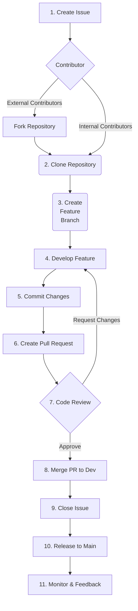

---  
sidebar_position: 1  
sidebar_label: Tazama Contribution
id: tazama-contribution-requirements
title: Tazama Contribution
date: 2024-09-09 12:17:22
author: Rob Reeve
description: Tazama Contribution Requirements
tags: 
  - WIP
  - Tazama
  - Contributing
---  

<!-- SPDX-License-Identifier: CC-BY-SA-4.0 -->

## Introduction

Hello and welcome! This document is taken [from GitHub](https://github.com/tazama-lf/.github/blob/main/CONTRIBUTING.md).

## Scope of the Guide

This contribution guide will take you through the steps to contribute to the Tazama Project and to help your contributions be successfully integrated into the Product.

It will cover their code of conduct for healthy community participation, and then walk you through everything you need to be able to contribute in the way you would like.

## Code of Conduct

The Project subscribes to the Linux Foundation's Code of Conduct as represented in the Linux Kernel Code of Conduct. The Linux Kernel Code of Conduct is itself derived from the Contributor Covenant v1.4. The Tazama Code of Conduct is based on v2.1, the most recent version at the time of writing.

In an effort to keep the contribution guide focused and lean, The Code of Conduct is hosted on its own separate page: [Tazama Code of Conduct](https://github.com/tazama-lf/.github/blob/main/CODE_OF_CONDUCT.md).

References:

- [Linux Kernel Code of Conduct](https://docs.kernel.org/process/code-of-conduct.html)
- [Contributor Covenant](https://www.contributor-covenant.org/)

## Types of Contributors

The contribution guide addresses different kinds of contributors. It is not intended to be an exhaustive or exclusive list, but the classification of contributors helps them to support each contributor according to thei specific needs.

- You are an ***Individual Contributor*** if you are exploring and using the product in an individual, unaffiliated capacity, and you want to contribute to the product for its, or your, own sake.
- You are a ***System Integrator*** if you want to implement the product for your customers, either as a standalone product or as part of your adjacent products, and you'd like to contribute to the product because you are introducing new features that would benefit the product or other users as well. This is the "Offical" designation LexTego works under.
- You are a ***Commercial End User*** if you want to implement the product for yourself directly or in partnership with a System Integrator and you are implementing new features that you think would benefit the product or other users as well.
- You are a ***Big Tech Organization*** or ***Charitable Organization*** who wants to contribute to the product in pursuit of [Digital Public Goods](https://digitalpublicgoods.net/) objectives.

For the most part, because Tazama is an open source software product, they expect that contributors would want to contribute `code`, or documentation on the `code`, and this guide would be focused on helping you to do that.

## Required Skills and Knowledge

Some experience in the following technologies would make contribution to the Project a little easier.

### Development and developer tools

- [GitHub](https://github.com/): The code is hosted in Tazama's own GitHub repository and understanding the basics of GitHub and git processes will help you access, update and submit code to the Project. They also use GitHub issues to document and track user stories.
- [GitHub Actions](https://github.com/features/actions) to automate some Continuous Integration (CI) processes in support of developer tasks
- [Typescript](https://www.typescriptlang.org/): The code is mostly written in TypeScript, a strictly typed implementation of JavaScript, which transpiles into JavaScript code for execution via [Node.js](https://nodejs.org/en).
- [Jest.js](https://jestjs.io/): Unit tests for the TypeScript code is written in Jest as part of the development process. We aim for test-driven development and complete test coverage.
- [Postman](https://www.postman.com/): Integration, end-to-end and some unit testing is currently performed via Postman which uses extensive [JavaScript](https://www.javascript.com/) scripts to automate the tests.
- [Docker](https://www.docker.com/): The software runs in Docker containers and containerization of the product and its components is an integral part of the development, testing and deployment processes.
- [Prettier](https://prettier.io/) and [ESLint](https://eslint.org/): Promote and enforce consistent coding practices for the delivery of quality code.
- [Visual Studio Code](https://code.visualstudio.com/): Though there are many tools available, most Tazama developers use VS Code to write code (most instructions provide guidance).

#### Third party Open Source Software components

The Product is composed out of a wide variety of other Open Source Software components, ranging from industry veterans to young-and-upcoming contenders. Experience in any of the components used would be very helpful in standing a bit more firmly on the shoulders of giants:

- [ArangoDB](https://www.arangodb.com) for multi-modal key-value and graph data storage
- [Elastic](https://www.elastic.co/elastic-stack) (specifically Elastic, Logstash and Kibana (ELK)) for system logging, observability and reporting
- [Jupyter Notebooks](https://jupyter.org/) to support data analytics, business intelligence and data science tasks
- [NATS](https://nats.io/) for pub/sub inter-services communication
- [OpenAPI](https://www.openapis.org/) - a.k.a. Swagger - to describe the HTTP APIs
- [Protocol Buffers](https://protobuf.dev/) for inter-services data serialization
- [Redis](https://redis.io/) for high-speed in-memory data caching

#### DevOps

From a DevOps perspective, we make use of the following tools:

- [Helm](https://helm.sh/) to define the build and deployment of our system
- [Jenkins](https://www.jenkins.io/) to automate our build, test and deployment processes
- [Kubernetes](https://kubernetes.io/) for the automated deployment of containers and to scale and manage our containerized system components
- [Newman](https://learning.postman.com/docs/collections/using-newman-cli/command-line-integration-with-newman/) to automatically execute Postman tests as part of the automated build, test and deployment process
- [YAML](https://yaml.org/) to provide scripting to guide automated deployment processes

#### Documentation

- [Markdown](https://www.markdownguide.org/) for documentation hosted in GitHub
- [Mermaid.js](http://mermaid.js.org/#/) for markdown-embedded diagrams in GitHub
- [Drawio](https://www.drawio.com/) for embedded diagrams in GitHub. See [guide for draw.io](https://github.com/frmscoe/docs/blob/main/Guides/drawio-guide.md).

## Setting Up the Development Environment

See the Tazama Core Section of the Dependencies documentation.


[Top](#contribution-guide)

#### 3.2.2. Microprocessor setup instructions
Follow these step-by-step instructions to get your local machine ready to work on a Tazama microservice processor. First we are going to set up the core services that all microservice processors rely on, and then we'll set up a specific microservice and get that ready for you to work on.

##### A. Preparation <!-- omit from toc -->
<u>**Step 1**: *Setting up GitHub Token Locally*</u>
- Generate a GitHub Personal Access Token to access the GitHub API:
   - Visit the GitHub Tokens page while logged into your GitHub account (Click your profile picture in the top right corner, then `Settings`, then `Developer settings`, then `Personal access tokens`, then `Tokens (classic)`)
   - Click on the `Generate new token` button and select `Generate new token (classic)`.
   - Provide a name for your token and select the scopes or permissions required. For this case, you will need at least the `read:packages` scope.
   - Scroll down and click on the `Generate token` button at the bottom.
   - Copy the generated token immediately (this token won't be visible again).

- Set the Environment Variable on your local machine:
   - Open your terminal or command prompt.
   - Substitute `your-github-token` below with the token you copied.
   - On Unix/Linux/Mac:
      ```
      export GH_TOKEN=your-github-token
      ```
   - On Windows (Command Prompt - Run as Administrator):
      ```
      setx GH_TOKEN your-github-token /m
      ```
   - On Windows (PowerShell):
      ```
      $env:GH_TOKEN="your-github-token"
      ```

<u>**Step 2**: *Set up core services*</u>

- **Set up a Docker network**:
   - Before you start creating Docker containers to host all the service containers, you will need to create a bridge network so that the containers will be able to talk to each other. To set up a bridge, open a Windows Command Prompt and execute the following command:

      ```
      docker network create --driver bridge tazama-net 
      ```
      This command will create a local user-defined bridge network called `tazama-net` that we can use to network our containers together.

- **ArangoDB**:
   - Follow the installation instructions for ArangoDB from the official [ArangoDB website](https://docs.arangodb.com/stable/operations/installation/). We recommend that you install the official ArangoDB Docker image for `v3.11.7` via [Docker Hub](https://hub.docker.com/_/arangodb/).
     - Start the Docker Desktop in Windows
     - In a Windows Command Prompt:
      ```
      docker pull arangodb:3.11.7
      ```
   - Start the ArangoDB server in a Docker container:

      In a Windows Command Prompt:
      ```
      docker run -p 8529:8529 --network=tazama-net -e ARANGO_NO_AUTH=1 --name arangodb-instance -d arangodb:3.11.7
      ```
      **Note**: This command will start an ArangoDB instance that does not require any user authentication - this is useful for testing, but should never be used in a production setting. See [here](https://docs.arangodb.com/stable/deploy/single-instance/manual-start/#authentication) for alternative options.
   - The ArangoDB web interface can now be accessed at <http://localhost:8529>.
   - Set up ArangoDB with a Postman collection from the [Tazama Postman repository](https://github.com/frmscoe/postman)
    - The specific collection you need for the database configuration is <https://github.com/frmscoe/postman/blob/main/ArangoDB%20Setup.json> - we will only need the contents of the `/1-ArangoDB-setup` and `/3-ArangoDB-Default-Configuration` folders in this collection for now.
    - You will also need the environment file for interacting with a local instance of ArangoDB via Postman/Newman: <https://github.com/frmscoe/postman/blob/main/environments/Tazama-LOCAL.postman_environment.json>
     - You can import these files (or the entire Postman repository) into your installed Postman application to run, or you can run the collection with Newman.

       Both methods assume that you have cloned the Postman repository onto your local machine. You can do that with the following command from the folder where you want the repository to be located:
       ```
       git clone https://github.com/frmscoe/postman
       ```
     - The Newman method is a little more straightforward to configure your instance of ArangoDB in Docker - you can do so with the following commands in a Windows Command Prompt:
        ```
        newman run collection-file --folder "1-ArangoDB-setup" -e environment-file --timeout-request 10200
        ```
        to execute the contents of the `1-ArangoDB-setup` folder, and
        ```
        newman run collection-file --folder "3-ArangoDB-Default-Configuration" -e environment-file --timeout-request 10200
        ```
        to execute the contents of the `3-ArangoDB-Default-Configuration` folder.
        
         - Replace `collection-file` with the full location path and filename of the `ArangoDB Setup.json` file in your cloned Postman repository
         - Replace `environment-file` with the full location path and filename of the `environments/Tazama-LOCAL.postman_environment.json` file in your cloned Postman repository
         - If the path contains spaces, wrap the string in double-quotes.

- **NATS**:
   - Follow the installation instructions for NATS from the official [NATS website](https://nats.io/download/). We recommend that you install the official NATS Docker image for the `latest` version via [Docker Hub](https://hub.docker.com/_/nats).
     - Start the Docker Desktop in Windows
     - In a Windows Command Prompt:
      ```
      docker pull nats
      ```
   - Start the NATS server in a Docker container:
     - In a Windows Command Prompt:
      ```
      docker run -p 4222:4222 -p 8222:8222 -p 6222:6222 --network=tazama-net --name nats-server -dti nats:latest
      ```

- **redis**:
   - Follow the installation instructions for redis from the official [redis website](https://redis.io/docs/install/install-redis/). We recommend that you install the official redis Docker image for the `latest` version via [Docker Hub](https://hub.docker.com/_/redis).
     - Start the Docker Desktop in Windows
     - In a Windows Command Prompt:
      ```
      docker pull redis/redis-stack-server
      ```
   - Start the redis server in a Docker container:
     - In a Windows Command Prompt:
      ```
      docker run -p 6379:6379 --network=tazama-net --name redis-stack-server -d redis/redis-stack-server:latest
      ```

- **Tazama NATS REST Proxy**:
    
    Tazama is composed out of a number of different processors that are chained together using a pub/sub framework facilitated by NATS. Only the front-most processor, the TMS API, is accessible directly via a traditional API: the remaining (down-stream) processors are only accessible via their respective NATS subscription subjects.
    
    The Tazama NATS REST Proxy provides an API that enabled access directly into the down-stream processors to assist in the development and testing process.

    If interaction with Tazama is expected to be solely through the TMS API, the proxy will not be required.

   - Install the Tazama NATS REST Proxy Docker image for the `latest` version via the GitHub Container Registry:
     - Start the Docker Desktop in Windows
     - In a Windows Command Prompt:
      ```
      docker pull ghcr.io/frmscoe/nats-utilities:latest
      ```
   - Start the redis server in a Docker container:
     - In a Windows Command Prompt:
      ```
      docker run -p 3000:3000 --network=tazama-net -e NODE_ENV=dev -e SERVER_URL=nats-server:4222 -d --name nats-utilities ghcr.io/frmscoe/nats-utilities:latest
      ```
[Top](#contribution-guide)

##### B. Setting Up a Microservice Processor to Work On <!-- omit from toc -->

Let's pick an easy microservice processor to use as an example. Tazama is designed to run a number of rule processors to evaluate incoming transactions. By default, the sample rule processor, `Rule 901`, is configured in this development environment through the ArangoDB Postman scripts above. All the rule processors run inside the `Rule Executer` wrapper function, which is itself configured to contain `Rule 901` by default. To run `Rule 901`, we need to run the `Rule Executer`.

Follow the steps below to get the `Rule Executer` on your operating table:

1. Clone the GitHub Repository

    - Open a Windows Command Prompt and navigate to the folder where you want to store your code.
    - The following `git` command will clone Rule 901's code to your local machine:

        ```
        git clone https://github.com/frmscoe/rule-executer
        ```
        As you can probably guess, this command will also let you clone any of the repositories in the `frmscoe` that you have access to by specifying their specific URL after the `git clone` command.

2. Navigate to the Repository Folder

    Using the Windows `cd` or `chgdir` command, navigate to the newly cloned repository folder:
    ```
    cd rule-executer
    ```

3. Install Dependencies

    Using `npm`, you can install all the dependencies for the processor as specified in the `package.json` file in the repository folder:
    ```
    npm install
    ```

4. Configure Environment Variables:

    Each microservice processor's configuration is specified as environment variables that are located in a dot env (`.env`) file. Your cloned repository does not have one yet: we'll have to create it from the `.env.template` file that is already in your folder. You can copy this file with from your Windows Command Prompt:
    ```
    copy .env.template .env
    ```
    The default settings in the `.env` will be fine if you followed the installation guidelines above without changes, so you won't have to update the `.env` file just yet.

    Don't over-write or make changes in the `.env.template` file or these changes might be unintentionally merged with the source code when your code is committed.

5. Build the Node.js Application

    Use the following `npm` command to build the application which will add a folder called lib or build to the repository folder. 
      ```
      npm run build
      ```
    This new build folder won't be included in a future code commit - it has been excluded via the `.gitignore` file.

6. Open the Folder in VS Code

    To start development you can open VS Code in the repository folder with the following command in a Windows Command Prompt from the repository folder:
    ```
    code .
    ```

7. Start the Node.js Application

    In your Windows Command Prompt, you can run the microservice processor with the following command:
    ```
    npm run start
    ```
    This command starts the Rule Executer application, with Rule 901 inside it, from the built code. Once the processor is up and running, you can start sending requests to the processor via the NATS REST Proxy.
    
    The `npm run start` command will keep on running until you exit the application by pressing `ctrl-c`.

8. Sending messages to the microservice processor via the NATS REST Proxy

    Let's try to send a test message to our locally running Event Director via the NATS REST Proxy using a pre-fabricated Postman test. If you previously cloned the Postman repository, the `Rule-901-Quick-Check.postman_collection.json` test will be located in the Postman repository folder.
    
    Because the application is running in our previous Windows Command Prompt, we'll need to open a new one and then, using the following Newman command in the new Command Prompt, we can execute the test on our running processor:

    ```
    newman run collection-file -e environment-file --timeout-request 10200
    ```
    
      - Replace `collection-file` with the full location path and filename of the `Rule-901-Quick-Check.postman_collection.json` file in your cloned Postman repository
      - Replace `environment-file` with the full location path and filename of the `environments/Tazama-LOCAL.postman_environment.json` file in your cloned Postman repository
      - If the path contains spaces, wrap the string in double-quotes.

9. Run the Built-In Jest Tests

    If you want to execute the accompanying Jest tests for the processor, you can also perform this task via `npm`. In your Windows Command Prompt, execute the following command from the repository folder:
    ```
    npm run test
    ```
[Top](#contribution-guide)

##### Additional Configuration (if needed): <!-- omit from toc -->

Different microservice processors may need to be set up in slightly different ways. Refer to the project documentation or processor README for any additional configuration instructions.

Check for specific database setup, API keys, or other dependencies.

#### Troubleshooting: <!-- omit from toc -->
- If you encounter issues during the setup process, refer to the project's issue tracker on GitHub or the documentation for troubleshooting steps.
- Ensure that your system meets the specified requirements
- If a shell command fails at first, try running your shell in administrator mode.

#### Conclusion: <!-- omit from toc -->
You have successfully set up a Tazama microservice processor on your local machine. If you encounter any difficulties or have questions, refer to the project's documentation or seek help from the project's community on GitHub or Slack. Happy coding!

[Top](#contribution-guide)

## 4. How to Contribute
### 4.1 Understanding the Project Structure

Read the [Product Overview](https://github.com/frmscoe/docs) for a detailed overview of the system.

The Project organization on GitHub contains both PUBLIC and PRIVATE repositories. Core components of the system are in public repositories that are accessible to anyone:

- The Transaction Monitoring Service (TMS) API
- The Event Director (ED)
- The Rule Executor (the rule processor wrapper function)
- Rule 901, a sample rule
- The Typology Processor
- The Transaction Aggregation and Decisioning Processor (TADProc)

... and various library and supporting repositories and tools.

All of our pre-fabricated rule processors, along with their unit tests and default configurations, are hosted in private repositories. That is not to say that they are not also open source software, but we are hosting them in private repositories because they might allow fraudsters and money launderers to reverse engineer the way the system detects fraud and money laundering "out of the box". Any member of our GitHub organization can access the private repositories to implement and work on the rule processors or their tests.

### 4.2 Finding Something to Work On

There are many ways to contribute to an open-source software project such as Tazama. Tazama is constantly under development as our community works to improve the software. When we encounter tasks that we think might be a good first issue for someone new to the project to undertake, we create the issue in the [`/tazama-project`](https://github.com/frmscoe/tazama-project) repository and tag it with the label: "good first issue". You can click on the [good first issue](https://github.com/frmscoe/tazama-project/issues?q=is%3Aissue+is%3Aopen+label%3A%22good+first+issue%22) label to display all the current issues under this label.

If there are currently no issues under this label, feel free to explore the project on your own and identify possible fixes or enhancements. Make sure to submit your feature or bug fix request to the `/tazama-project` repository as a new issue for consideration by the team. It would be good to reach out to us to discuss your issue before you start though, just in case it's something we have already considered.

### 4.3 Contribution Process Overview



[Top](#contribution-guide)

## 5. Making and Submitting Contributions

### 5.2 Making Changes
Best practices for making changes.

#### 5.2.1 Tazama coding practices

The definition of done includes adhering to the coding practices below:

##### 5.2.1.1. Linting & Linting rules <!-- omit from toc -->

Tazama uses [ESLint](https://eslint.org/) to enforce consistency and specific rules in our use of TypeScript. We have implemented. We implemented the ESLint "[flat config](https://eslint.org/blog/2022/08/new-config-system-part-2/)" in release 2.0.0 of Tazama.

###### ESLint Configuration Documentation <!-- omit from toc -->

This document details the ESLint configuration for TypeScript files as specified in the `eslint.config.mjs` file. The configuration integrates multiple plugins to enforce style and quality standards.

###### Configuration Overview <!-- omit from toc -->
 
- **Files Targeted**: 
  - Applies to all `.ts` files across the project.

- **Plugins Used**: 
  - Integrates plugins from `eslint-config-love`, `eslint-plugin-eslint-comments`, `@typescript-eslint/eslint-plugin`, and `@stylistic/eslint-plugin`.

- **Parser**: 
  - Uses `@typescript-eslint/parser` for parsing TypeScript files.

- **ECMA Version**: 
  - Configured for ECMAScript 2022 to support modern JavaScript features.

- **Source Type**: 
  - Files are treated as ECMAScript modules.

###### Rules Summary <!-- omit from toc -->

###### Standard and Plugin Rules <!-- omit from toc -->
- Inherits rules from `eslint-config-love`.
- Incorporates recommended rules from `eslint-plugin-eslint-comments`.

###### TypeScript Specific Rules <!-- omit from toc -->
- `@typescript-eslint/restrict-template-expressions`: Errors on unsafe usage in template literals.
- `@typescript-eslint/no-non-null-assertion`: Disabled.
- `@typescript-eslint/strict-boolean-expressions`: Disabled to allow any type in conditions.
- `@typescript-eslint/no-explicit-any`: Errors when the `any` type is used, promoting type safety.
- `@typescript-eslint/no-floating-promises`: Allows floating promises without handling.
- `@typescript-eslint/no-var-requires`: Permits using `require` statements in TypeScript.
- `@typescript-eslint/no-use-before-define`: Disabled to allow hoisting.
- `@typescript-eslint/prefer-optional-chain`: Does not enforce using optional chaining.

###### Stylistic Rules (Custom Plugin) <!-- omit from toc -->
- `@stylistic/indent`: Enforces 2 spaces for indentation.
- `@stylistic/semi`: Requires semicolons at the end of statements, warning level.
- `@stylistic/quotes`: Enforces single quotes for strings.
- `@stylistic/quote-props`: Requires quotes around object properties when necessary.
- `@stylistic/arrow-parens`: Requires parentheses around arrow function arguments.

###### ESLint Comments Plugin <!-- omit from toc -->
- `eslint-comments/require-description`: Warns if ESLint directive comments lack a description.
- `eslint-comments/disable-enable-pair`: Warns to ensure proper use of `eslint-disable` and `eslint-enable` pairs. Sometimes, linting and coding practices collide and a linting override is required to suppress linting alerts over a specific segment of code. While it is possible to override linting for an entire code module, this is not the Tazama way and instead a linting override is expected to only be applied to the specific problematic segment of code via the use of these comment tags above and below the code segment.

###### Ignored Files and Directories <!-- omit from toc -->
- **Ignored Locations**: 
  - `**/build/**` or `**/lib/**` // tsc output directory (project)
  - `**/node_modules/**`
  - `**/docs/**`
  - `**/__tests__/**`
  - `**/coverage/**` // jest coverage
  - `**/jest.config.ts` // jest main config
  - `**/jest.testEnv.ts` // jest env config

This setup ensures a robust framework for maintaining high code quality and consistency in TypeScript projects, leveraging ESLint's core capabilities and additional style rules from external plugins.

##### 5.2.1.2. Gather asynchronous requests <!-- omit from toc -->

When you have multiple asynchronous requests to make, Tazama prefers the requests to operate in parallel using [`Promise.all`](https://developer.mozilla.org/en-US/docs/Web/JavaScript/Reference/Global_Objects/Promise/all).

[Top](#contribution-guide)

#### 5.2.2 Definition of done

The tasks below must be completed by the code contributor before the Pull Request(PR) is submitted:

**Code Complete** - Source code changes are complete for all items in the acceptance criteria in the issue supporting the story. In Tazama, code is distributed amongst a number of different repositories for specific purposes. Code changes in a single repository should be linked to an issue in that repository. Similar changes that affect a number of different repositories, should be documented as an issue in each of those repositories separately.

**Code Refactoring** - Source code has been refactored to make it comprehensive, maintainable and amenable to change (*unless agreed otherwise as part of refactoring existing legacy code).

**Code Check-in** - Source code is checked in to source code control repository and the PR process is followed.

**Code & Peer reviews** (pull requests) - Code reviews and Peer reviews have been carried out and all improvements implemented and tests completed. Contributor to follow-up and ensure code gets merged in a reasonable time.

**Code Documentation** - Source code has been commented. Complex or compound statements should be explained with a comment, either a comment block (e.g. `/* comment block here */` in TypeScript) or an in-line comment (e.g. `// in-line comment here` in TypeScript). Every function in Tazama must be documented with a preceding [JSDocs docstring](https://www.typescriptlang.org/docs/handbook/jsdoc-supported-types.html).

**Developer Documentation** - The readme.md file in every GitHub code repository must contain documentation in markdown and diagrams, in Mermaid or editable `.svg` or `.png` images. See  [guide for draw.io](https://github.com/frmscoe/docs/blob/main/Guides/drawio-guide.md), to explain how the code works. 

**Licensing comment** Add the following string as a comment ("SPDX-License-Identifier: Apache-2.0") at the top of every file in the organization in GitHub that is capable of including a comment i.e. extensions="ts" "js" "env" "template" "eslintignore" "yaml" "properties" "npmrc" "editorconfig" "dockerignore" "gitignore" "prettierignore" "md" "helmignore" "Makefile" "sh" "npmignore" "plantuml" "yml".

**Unit testing** - Unit test cases have been created in Jest (https://jestjs.io/), executed and are working successfully. Follow [coverage guidelines](https://github.com/frmscoe/docs/blob/main/Technical/unit-test-coverage.md). 

**Processor performance benchmarking** Ensure that the Newman benchmark results have been presented on the PR as a comment. If you notice any spikes in the benchmark, please report the spike or reevaluate the implemented code.

**Automated Builds** - All code is included in automated builds and any updates to the build scripts have been completed and tested and checked in. Jenkins / CircleCI - Poly vs Mono repo

**GitHub CI/CD** - Ensure that all GitHub workflows have completed successfully during PR checks.

**Logging** - Appropriate logging and log levels implemented [Logging framework](https://github.com/frmscoe/docs/Technical/Logging/The-Tazama-Logging-Framework.md) 

**All acceptance criteria are met and Testing complete**

- **Automated testing** - All existing automated tests have been run successfully

- **Regression testing** – Regression testing has been carried out successfully

### Guide for maintainers <!-- omit from toc -->

**Architecture** - All new code conforms to the agreed architecture (*unless agreed otherwise as part of refactoring existing legacy code). 

### 5.3 Committing Your Changes

When committing changes to your development branch you would be required to submit a commit message to describe the change. Depending on the mechanism that you are using to commit your changes, you may have access to a commit message as well as an extended description of your changes, but it is expected that you should complete at least the commit message.

Tazama aims to comply with the [Conventional Commits](https://www.conventionalcommits.org/en/v1.0.0/) specification for adding human and machine-readable meaning to commit messages (subject to the commit types recommended below).

A commit message must be a short description of the change, prefaced with a commit type:

```
type: short description
```

The commit message should also include a scope:

```
type(scope): short description
```

If the change is a breaking change, the type should be following by an exclamation:

```
type!: short description
```

Recommended commit types for Tazama are based on the [Angular convention](https://github.com/angular/angular/blob/22b96b9/CONTRIBUTING.md#type), summarized for ease of reference:

- **build**: Changes that affect the build system or external dependencies
- **ci**: Changes to our CI configuration files and scripts
- **docs**: Documentation only changes
- **feat**: A new feature
- **fix**: A bug fix
- **perf**: A code change that improves performance
- **refactor**: A code change that neither fixes a bug nor adds a feature
- **style**: Changes that do not affect the meaning of the code (white-space, formatting, missing semicolons, etc.)
- **test**: Adding missing tests or correcting existing tests

Note: **chore** is not in the recommended list of commit types

Scope keywords are tailored to Tazama's specific requirements. Tazama's source code is spread across a number of repositories and as such even small changes often affect a number of separate repositories simultaneously. This complicates source control a bit, since a number of changes across different repositories may all be related to a single requirement. For the sake of proper governance, the requirement would be logged as an issue in each of the affected repositories to outline the acceptance criteria for the change in *that* repository and also to provide an anchor for the eventual Pull Request to implement the change in that repository. From this perspective, the scope is generally either confined to a single repository that represents a single Tazama processor, or a cluster of repositories representing a number of Tazama processors.

- If your change is limited to a single repository, the scope should be the name of the repository, e.g. `typology-processor` or `rule-executer`.
- If your change impacts multiple repositories, the scope should be `multi-repo`.

### 5.4 Submitting a Pull Request
Steps to create and submit a pull request.

### 5.5 Code Review Process
What to expect during the code review.

[Top](#contribution-guide)

## 6. Community and Communication
### 6.1 Communication Channels
Information on communication channels like mailing lists and chat.

### 6.2 Regular Meetings or Calls
Information about regular community calls or meetings.

## 7. Documentation Contributions
### 7.1 Contributing to Documentation
Guidelines for contributing to project documentation.

### 7.2 Documentation Style Guide

The aim of this style guide section is to ensure that Tazama documentation is consistent, clear and professional, regardless of the number of contributors.

**Location:** General documentation is maintained in the `docs` repository. Developer documentation is maintained in the README in the repository where the source code is located.

**File names** Markdown file names in the `docs` repository should be all lower case with dashes `-` (and no spaces) e.g. rule-processor-overview. The README files in the repositories are named with all CAPS.

**Format:** Documentation is created in Markdown files. We recommend using [Markdown All in One by Yu Zhang](https://marketplace.visualstudio.com/items?itemName=yzhang.markdown-all-in-one) 

**Language and Grammar:** Tazama documentation uses American English. We recommend using [LTeX – LanguageTool grammar/spell checking by Julian Valentin](https://valentjn.github.io/ltex) 

**Tone:** Friendly, encouraging, and welcoming. The style should convey openness and support for new contributors, making them feel valued and part of the community.

**Voice:** Use an active voice to engage the reader directly. 

**Clarity:** Ensure that instructions are clear and straightforward. Avoid jargon or overly technical language to make the content accessible to new contributors.

**Terminology:** Update the project [Glossary](https://github.com/frmscoe/docs/blob/main/Product/Glossary.md) with acronyms, abbreviations, and industry-specific jargon. Consistent use of terminology helps avoid confusion. 

**Consistency:** Maintain a consistent structure in the text, using bullet points or numbered lists for step-by-step instructions. This helps in readability and easy navigation. We recommend [The Ultimate Markdown Cheat Sheet/ numbered lists and bullets](https://github.com/lifeparticle/Markdown-Cheatsheet?tab=readme-ov-file#lists)

**Headings and Structure:** Use multiple levels of numbered headings, for example in this Contribution Guide. This helps in organizing content logically and makes it easier to navigate. We recommend [The Ultimate Markdown Cheat Sheet/ headings](https://github.com/lifeparticle/Markdown-Cheatsheet?tab=readme-ov-file#headings)

**Table of Contents** Include a table of contents at the top of the page, for example in this Contribution Guide, and link to the top of the page at intervals through the document e.g. [Top](#contribution-guide)

FIX IMAGE Top /images/contribution-guide-style-top.png

**Detail:** Provide enough detail to guide the contributor but avoid overwhelming them with information. Include links to additional resources for those who want to dive deeper.

**Code Formatting:** Code snippets should be formatted in its own distinct block, using triple backticks.  Within documentation, JSON should be formatted automatically using `Shift`+`Alt`+`f`.

FIX IMAGE json snippet /images/contribution-guide-style-json.png

**Backticks** Single `backticks` ` are used to format inline code, commands, variables, filenames within a sentence. Using backticks appropriately helps in clearly distinguishing code or special text from regular content, enhancing readability and comprehension.

**Links and References:** Set rules for linking to external resources, citing sources, and referencing other parts of the documentation. This includes guidelines on hyperlink text and formatting. We recommend [The Ultimate Markdown Cheat Sheet /links and references](https://github.com/lifeparticle/Markdown-Cheatsheet?tab=readme-ov-file#links)

**Images:** Images should be editable `.svg` or `.png` files. See  [guide for draw.io](https://github.com/frmscoe/docs/blob/main/Guides/drawio-guide.md). All images should be saved in the docs/images folder.  

FIX IMAGE docs/images folder images/contribution-guide-style-images-folder.png

Image file names should be lower case with dashes `-` (and no spaces). Include the document name and/or section name where the image will be inserted e.g. contribution-guide-style-images-folder.png 

[Top](#contribution-guide)

## 8. Reporting Bugs and Requesting Features
### 8.1 How to Report Bugs
Process for reporting bugs.

### 8.2 Suggesting Enhancements
How to propose new features or enhancements.

## 9. Legal Compliance
### 9.1 Licensing Information

You can access the Tazama License here > [SPDX-License-Identifier: Apache-2.0](https://github.com/frmscoe/.github/blob/main/LICENSE)

### 9.2 Contributor License Agreement (CLA)
Information about and how to sign the CLA.

## 10. Acknowledgements
### 10.1 Recognizing Contributors
How the project acknowledges contributions.

### 10.2 Community Contributors
List notable contributors (optional).

## 11. Getting Help
### 11.1 Resources for Help
Where to find help.

### 11.2 Contact Information
How to contact the core team for assistance.

## 12. Appendix
### 12.1. Additional Resources

<https://opensource.guide/>

[Top](#contribution-guide)

### 12.2 Glossary

| Term | Definition |
|---|---|
| Author | The person/s or organization that created the project (For Tazama, that's [LexTego](www.lextego.com) and [Sybrin](www.sybrin.com))
| Owner | The person/s who has administrative ownership over the organization or repository (not always the same as the original author ([The Tazama Project](www.tazama.org), a member of the Linux Foundation))
| Maintainers | Contributors who are responsible for driving the vision and managing the organizational aspects of the project (They may also be authors or owners of the project.)
| Contributors | Everyone who has contributed something back to the project
| Community Members | People who use the project. They might be active in conversations or express their opinion on the project's direction

Project [Glossary](https://github.com/frmscoe/docs/blob/main/Product/Glossary.md)